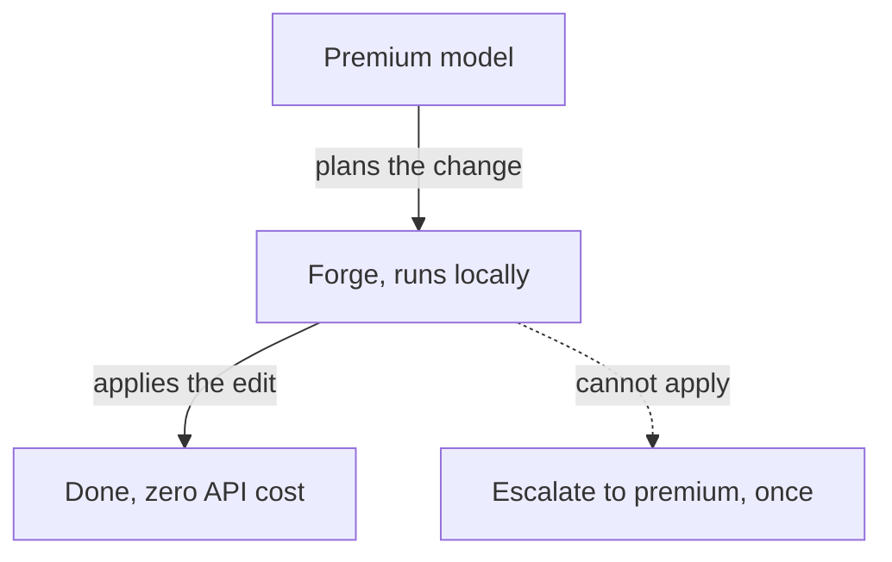

**Forge** is Orkestral's bundled local code model. It runs entirely on your machine
(Qwen2.5-Coder via `node-llama-cpp`, GGUF) and executes the actual code changes,
so routine work costs **nothing** in API fees.

## The idea: premium plans, local executes

A premium model is great at *planning*. The Forge is great (and free) at *doing*.
Orkestral splits the job so you pay only for the thinking, not the typing.

## Fast Apply

The Forge pairs with Orkestral's own **Fast Apply**, a deterministic engine that
merges edits into your files:

<Steps>
  <Step title="Exact match">
    Applies the change where it matches exactly.
  </Step>
  <Step title="Whitespace-normalized">
    Retries ignoring indentation/whitespace differences.
  </Step>
  <Step title="Safe fuzzy">
    A single-match fuzzy pass, and it **rejects** anything ambiguous rather than
    writing the wrong content.
  </Step>
</Steps>

Fast Apply only touches the changed lines, it never rewrites the whole file, and it
needs no external service.

## $0 by design

<Card title="Offline and free" icon="piggy-bank">
  Because the model is bundled and runs locally, executing changes uses no API
  credits and works with no internet connection. A cost view shows how many runs
  were resolved locally vs. escalated to a premium model.
</Card>

## When it escalates

If the Forge can't apply a change confidently, Orkestral escalates **once** to a
premium model as a fallback, so correctness is never sacrificed for cost.

<Note>
  The Forge model ships **inside the installer**, so it's ready on first launch with
  no extra download.
</Note>
