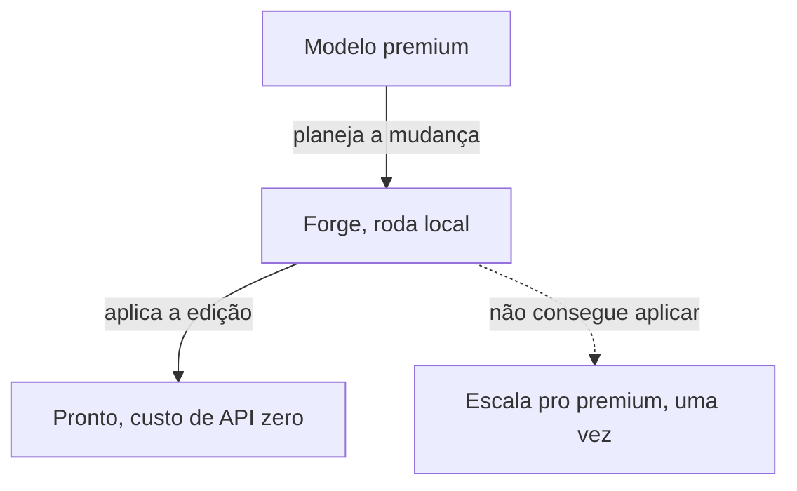

O **Forge** é o modelo de código local embutido do Orkestral. Ele roda inteiramente
na sua máquina (Qwen2.5-Coder via `node-llama-cpp`, GGUF) e executa as mudanças de
código de verdade, então o trabalho rotineiro custa **nada** em taxas de API.

## A ideia: premium planeja, local executa

Um modelo premium é ótimo pra *planejar*. O Forge é ótimo (e grátis) pra *fazer*. O
Orkestral divide o trabalho pra você pagar só pelo raciocínio, não pela digitação.

## Fast Apply

O Forge anda junto com o **Fast Apply** próprio do Orkestral, um motor
determinístico que funde as edições nos seus arquivos:

<Steps>
  <Step title="Match exato">
    Aplica a mudança onde bate exatamente.
  </Step>
  <Step title="Normalizado por espaços">
    Tenta de novo ignorando diferenças de indentação/espaços.
  </Step>
  <Step title="Fuzzy seguro">
    Uma passada fuzzy de match único, e **rejeita** qualquer coisa ambígua em vez
    de escrever o conteúdo errado.
  </Step>
</Steps>

O Fast Apply mexe só nas linhas alteradas, nunca reescreve o arquivo inteiro e não
precisa de serviço externo.

## $0 por design

<Card title="Offline e gratuito" icon="piggy-bank">
  Como o modelo é embutido e roda local, executar mudanças não usa créditos de API e
  funciona sem internet. Uma visão de custo mostra quantas execuções foram resolvidas
  localmente vs. escaladas pro modelo premium.
</Card>

## Quando escala

Se o Forge não consegue aplicar uma mudança com confiança, o Orkestral escala **uma
vez** pra um modelo premium como fallback, então a correção nunca é sacrificada pelo
custo.

<Note>
  O modelo Forge vem **dentro do instalador**, então está pronto no primeiro uso sem
  download extra.
</Note>
